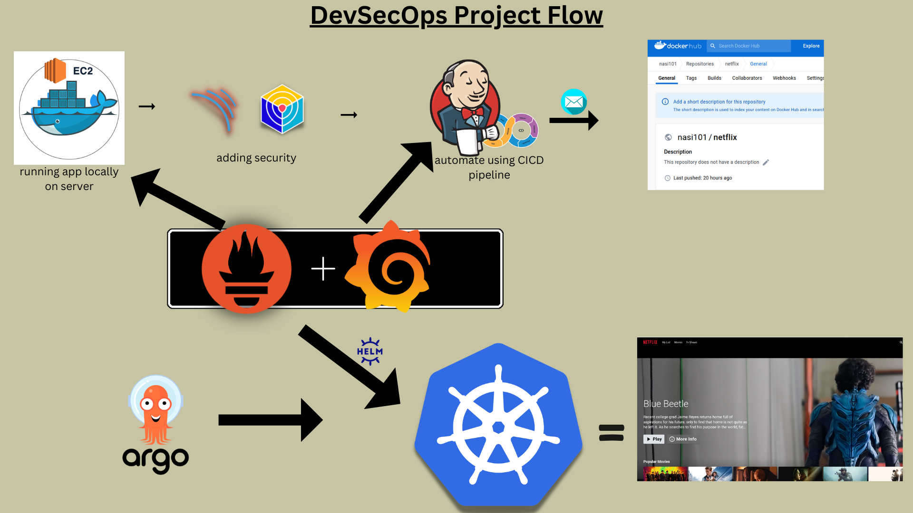

<div align="center">
  

  <br>
  <a href="http://netflix-clone-with-tmdb-using-react-mui.vercel.app/">
    
  </a>
</div>

<br />

<div align="center">
  
  <p align="center">Home Page</p>
</div>

# **Youtube Video for step by step Demonstration!**
[](https://youtu.be/g8X5AoqCJHc)


## Susbcribe:
[https://www.youtube.com/@cloudchamp?
](https://www.youtube.com/@cloudchamp?sub_confirmation=1)


# Deploy Netflix Clone on Cloud using Jenkins - DevSecOps Project!
Before we start the project there are following things that needs to be install.
  1. Java 17
    ```bash
    sudo apt update
    sudo apt install fontconfig openjdk-17-jre
    java -version
    openjdk version "17.0.8" 2023-07-18
    OpenJDK Runtime Environment (build 17.0.8+7-Debian-1deb12u1)
    OpenJDK 64-Bit Server VM (build 17.0.8+7-Debian-1deb12u1, mixed mode, sharing)
    ```
  3. Jenkins
     - You can refer this link on how to install Jenkins **https://github.com/Nisarg153/Jenkins_Installation**
     - Access Jenkins in a web browser using the public IP of your EC2 instance. 
        publicIp:8080
     - Make sure you are allowing 8080 port access in securtiy group of ec2 instance
  4. Docker
     - If you installing the docker on ec2 instance then copy and paste the following command in CLI:
     ```bash
     sudo apt update
     sudo apt install -y docker-ce docker-ce-cli containerd.io
     sudo systemctl start docker
     sudo systemctl enable docker
     sudo usermod -aG docker $USER
     newgrp docker
     sudo chmod 777 /var/run/docker.sock
     docker version
     docker run hello-world
     ```
     - If you are trying to install docker in your local system the you can follow the steps from **https://www.docker.com**
  6. Sonarqube
     - You can refer this link on how to install sonarqube **https://gist.github.com/Nisarg153/171fc33c4d8b1134355dd7b550b21273**
     - You also have to install sonar-scanner on jenkins server. you can do that by typing the following command:
       ```bash
       cd /opt
       sudo wget https://binaries.sonarsource.com/Distribution/sonar-scanner-cli/sonar-scanner-cli-5.0.1.3006-linux.zip
       sudo unzip sonar-scanner-cli-5.0.1.3006-linux.zip
       sudo mv sonar-scanner-5.0.1.3006-linux sonar-scanner
       # Add to PATH
       sudo ln -s /opt/sonar-scanner/bin/sonar-scanner /usr/local/bin/sonar-scanner
       sonar-scanner --version
       ```
     - To access: 
        publicIP:9000 (by default username & password is admin)
     - Make sure you are allowing 9000 port access in securtiy group of ec2 instance
     - Optional: Add SonarScanner in Jenkins UI
       If you want Jenkins to manage SonarScanner:
       1. Go to Manage Jenkins → Global Tool Configuration
       2. Scroll to SonarQube Scanner
       3. Click “Add SonarQube Scanner”
       4. Name: sonar-scanner
       5. Install automatically (or point to /opt/sonar-scanner)
       Then in Jenkinsfile, use:
       ```bash
       tools {
         sonarQubeScanner 'sonar-scanner'
       }
       ```
     - SonnarScanner requires JAVA (Java 11+ recommended).
  7. NodeJS
     ```bash
     sudo apt update && sudo apt upgrade -y
     curl -fsSL https://deb.nodesource.com/setup_18.x | sudo -E bash -
     sudo apt install -y nodejs
     sudo npm install -g n
     sudo n lts     # install latest LTS version
     sudo n 20.10.0 # or a specific version
     sudo npm install -g typescript
     ```
     - Use n to switch versions interactively with sudo n.
  8. Trivy
     ```bash
     sudo apt-get install wget apt-transport-https gnupg lsb-release
     wget -qO - https://aquasecurity.github.io/trivy-repo/deb/public.key | sudo apt-key add -
     echo deb https://aquasecurity.github.io/trivy-repo/deb $(lsb_release -sc) main | sudo tee -a /etc/apt/sources.list.d/trivy.list
     sudo apt-get update
     sudo apt-get install trivy
     trivy --version
     ```
     - Once installed, you can scan a Docker image like:
        ```bash
        trivy image <imageid>
        ```
       Or scan your file system:
       ```bash
       trivy fs .
       ```
  9. OWASP
     - Fix: Define "DP-Check" in Jenkins
       Step-by-step:
       1. Go to Manage Jenkins → Global Tool Configuration
       2. Scroll to the OWASP Dependency-Check section
       3. Click Add Dependency-Check
       4. Name it DP-Check ← This name must match what's in your pipeline
       5. Choose to install automatically, or point to a manually installed path
       6. Save
     - You can also manually install OWASP in your jenkins server
      ```bash
      cd /opt
      sudo wget https://github.com/jeremylong/DependencyCheck/releases/download/v8.4.0/dependency-check-8.4.0-release.zip
      sudo unzip dependency-check-*.zip -d dependency-check
      sudo chmod +x /opt/dependency-check/bin/dependency-check.sh
      echo 'export PATH=$PATH:/opt/dependency-check/bin' >> ~/.bashrc
      source ~/.bashrc
      dependency-check.sh --version
      ```
     - What Can OWASP Dependency-Check Detect?
        - Vulnerable libraries in:
            - Node.js (package-lock.json, npm-shrinkwrap.json)
            - Java (pom.xml, .jar, .war)
            - Python, .NET, Ruby (limited support)
        - CVEs (Common Vulnerabilities and Exposures)
        - Severity of issues (Critical, High, Medium, Low)
        - Exploit data from NVD
  10. Kubernetes
      - I have installed kubernets on my system
      - you can refer to this link to install **https://kubernetes.io/docs/tasks/tools/install-kubectl-windows**
      - you can also refer this youtube video **https://youtu.be/05MNwC4XJBs?si=r5gHQJabUxFGZdws**
### **Phase 1: Initial Setup and Deployment**

**Step 1: Clone the Code:**

- Update all the packages and then clone the code.
- Clone your application's code repository onto the EC2 instance or you can run this in your local system but make sure whereever you are cloning the repo docker must be installed and running:
    
    ```bash
    git clone https://github.com/N4si/DevSecOps-Project.git
    ```
    

**Step 2: Install Docker and Run the App Using a Container:**    
- Build and run your application using Docker containers:
    
    ```bash
    docker build -t netflix .
    docker run -d --name netflix -p 8081:80 netflix:latest
    
    #to delete
    docker stop <containerid>
    docker rmi -f netflix
    ```

It will show an error cause you need API key

**Step 4: Get the API Key:**

- Open a web browser and navigate to TMDB (The Movie Database) website.
- Click on "Login" and create an account.
- Once logged in, go to your profile and select "Settings."
- Click on "API" from the left-side panel.
- Create a new API key by clicking "Create" and accepting the terms and conditions.
- Provide the required basic details and click "Submit."
- You will receive your TMDB API key.

Now recreate the Docker image with your api key:
```
docker build --build-arg TMDB_V3_API_KEY=<your-api-key> -t netflix .
```

**Phase 2: Security**
       
1. **Integrate SonarQube and Configure:**
    - Integrate SonarQube with your CI/CD pipeline.
    - Configure SonarQube to analyze code for quality and security issues.

**Phase 3: CI/CD Setup**
       
1. **Install Necessary Plugins in Jenkins:**

Goto Manage Jenkins →Plugins → Available Plugins →

Install below plugins

1 Eclipse Temurin Installer 

2 SonarQube Scanner 

3 NodeJs Plugin

4 Email Extension Plugin

Restart the jenkins.

### **Configure Java and Nodejs in Global Tool Configuration**

Goto Manage Jenkins → Tools → Install JDK(17) and NodeJs(16)→ Click on Apply and Save

### SonarQube

Create the token

Goto Jenkins Dashboard → Manage Jenkins → Credentials → Add Secret Text. It should look like this

After adding sonar token

Click on Apply and Save

**The Configure System option** is used in Jenkins to configure different server

**Global Tool Configuration** is used to configure different tools that we install using Plugins

We will install a sonar scanner in the tools.

Create a Jenkins webhook

1. **Configure CI/CD Pipeline in Jenkins:**
- Create a CI/CD pipeline in Jenkins to automate your application deployment.
- if you are following the video then you can copy and paste the pipeline from https://github.com/N4si/DevSecOps-Project/blob/main/README.md
Certainly, here are the instructions without step numbers:

**Install Dependency-Check and Docker Tools in Jenkins**

**Install Dependency-Check Plugin:**

- Go to "Dashboard" in your Jenkins web interface.
- Navigate to "Manage Jenkins" → "Manage Plugins."
- Click on the "Available" tab and search for "OWASP Dependency-Check."
- Check the checkbox for "OWASP Dependency-Check" and Restart the jenkins.

**Configure Dependency-Check Tool:**

- After installing the Dependency-Check plugin, you need to configure the tool.
- Go to "Dashboard" → "Manage Jenkins" → "Global Tool Configuration."
- Find the section for "OWASP Dependency-Check."
- Add the tool's name, e.g., "DP-Check."
- Save your settings.

**Install Docker Tools and Docker Plugins:**

- Go to "Dashboard" in your Jenkins web interface.
- Navigate to "Manage Jenkins" → "Manage Plugins."
- Click on the "Available" tab and search for "Docker."
- Check the following Docker-related plugins:
  - Docker
  - Docker Commons
  - Docker Pipeline
  - Docker API
  - docker-build-step
- Click on the "Install without restart" button to install these plugins.

**Add DockerHub Credentials:**

- To securely handle DockerHub credentials in your Jenkins pipeline, follow these steps:
  - Go to "Dashboard" → "Manage Jenkins" → "Manage Credentials."
  - Click on "System" and then "Global credentials (unrestricted)."
  - Click on "Add Credentials" on the left side.
  - Choose "Secret text" as the kind of credentials.
  - Enter your DockerHub credentials (Username and Password) and give the credentials an ID (e.g., "docker").
  - Click "OK" to save your DockerHub credentials.

Now, you have installed the Dependency-Check plugin, configured the tool, and added Docker-related plugins along with your DockerHub credentials in Jenkins. You can now proceed with configuring your Jenkins pipeline to include these tools and credentials in your CI/CD process.

```groovy
pipeline {
    agent any
    tools {
        jdk 'JAVA'
        nodejs 'NodeJS'
    }
    stages {
        stage('Checkout') {
            steps {
                git credentialsId: 'githubcreds', url: 'https://github.com/Nisarg153/Netflix_Clone_Using_Kubernetes_DevSecOps_Project.git'
            }
        }
        stage('SonarQube Analysis') {
            steps {
                withCredentials([string(credentialsId: 'sonarqube', variable: 'SONAR_AUTH_TOKEN')]) {
                    sh '''
                        sonar-scanner \
                        -Dsonar.projectKey=Netflix \
                        -Dsonar.sources=. \
                        -Dsonar.host.url=http://<sonarqube-server-publicIP>:9000 \
                        -Dsonar.login=$SONAR_AUTH_TOKEN
                    '''
                }
            }
        }
        stage('Build and Test') {
            steps {
                sh 'ls -ltr'
                sh 'npm install'
                // build the project and create a JAR file
                // sh 'npx install tsc'
            }
        }
        stage('OWASP FS SCAN') {
            steps {
                dependencyCheck additionalArguments: '--scan ./ --disableYarnAudit --disableNodeAudit', odcInstallation: 'DP-Check'
                dependencyCheckPublisher pattern: '**/dependency-check-report.xml'
            }
        }


        stage('TRIVY FS SCAN') {
            steps {
                sh 'trivy fs . > trivyfs.txt'
            }
        }
        
        stage('Build and Push Docker Image') {
            environment {
                DOCKER_IMAGE = "nisarg153/netflix-cicd:${BUILD_NUMBER}"  # here for docker image use : <dockerid>/<imagename>:tag
                REGISTRY_CREDENTIALS = credentials('DockerCreds')
            }
            steps {
                script {
                    sh 'docker build --build-arg TMDB_V3_API_KEY=<your-api-key-from-TMDB> -t ${DOCKER_IMAGE} .'
                    def dockerImage = docker.image("${DOCKER_IMAGE}")
                    docker.withRegistry('https://index.docker.io/v1/', "DockerCreds") {
                        dockerImage.push()
                    }
                }
            }
        }
        stage('Update Deployment File') {
            environment {
                GIT_REPO_NAME = "Netflix_Clone_Using_Kubernetes_DevSecOps_Project"
                GIT_USER_NAME = "Nisarg153"
            }
            steps {
                withCredentials([string(credentialsId: 'github_token', variable: 'GITHUB_TOKEN')]) {
                    sh '''
                        git config user.email "<your-github-emailid>"
                        git config user.name "<github-username>"
            
                        # Ensure latest from GitHub
                        git pull https://${GITHUB_TOKEN}@github.com/${GIT_USER_NAME}/${GIT_REPO_NAME} master
            
                        # Dynamically update image tag in deployment.yml
                        sed -i "s|\\(nisarg153/netflix-cicd:\\).*|\\1${BUILD_NUMBER}|g" Kubernetes/deployment.yml
    
                        git add Kubernetes/deployment.yml
                        git commit -m "Update deployment image to version ${BUILD_NUMBER}" || echo "No changes to commit"
                        git push https://${GITHUB_TOKEN}@github.com/${GIT_USER_NAME}/${GIT_REPO_NAME} HEAD:master
                    '''
                }
            }
        }
    }
}

```

**Phase 4: Monitoring**
There are two ways you can monitor the applicaion:
1. Running prometheus and grafana in your local system
      - If you are doing CD part in your local machine then follow the below steps.
          - ## Create Kubernetes Cluster with Nodegroups
            In this phase, you'll set up a Kubernetes cluster with node groups. This will provide a scalable environment to deploy and manage your applications.( make sure you have installed the kubernetes on your local system).
            
            ## Monitor Kubernetes with Prometheus
            
            Prometheus is a powerful monitoring and alerting toolkit, and you'll use it to monitor your Kubernetes cluster. Additionally, you'll install the node exporter using Helm to collect metrics from your cluster nodes.
            
            ### Install Node Exporter using Helm
            
            To begin monitoring your Kubernetes cluster, you'll install the Prometheus Node Exporter. This component allows you to collect system-level metrics from your cluster nodes. Here are the steps to install the Node Exporter using Helm:
            
            1. Add the Prometheus Community Helm repository:
               ```bash
               helm repo add prometheus-community https://prometheus-community.github.io/helm-charts
               kubectl create namespace Prometheus
               helm install prometheus prometheus-community/prometheus --namespace Prometheus
               kubectl get pods -n Prometheus
               kubectl port-forward -n prometheus svc/prometheus-server 9090:80
               ```
            - Open localhost:9090 and enter the username as admin and paste the password.
            - Later, you can update it.


            2. Create a Kubernetes namespace for the Node Exporter:
            
                ```bash
                kubectl create namespace prometheus-node-exporter
                ```
            
            3. Install the Node Exporter using Helm:
            
                ```bash
                helm install prometheus-node-exporter prometheus-community/prometheus-node-exporter --namespace prometheus-node-exporter
                ```
            
            Add a Job to Scrape Metrics on nodeip:9001/metrics in prometheus.yml:
            
            Update your Prometheus configuration (prometheus.yml) to add a new job for scraping metrics from nodeip:9001/metrics. You can do this by adding the following configuration to your prometheus.yml file:
            
            
            ```
              - job_name: 'Netflix'
                metrics_path: '/metrics'
                static_configs:
                  - targets: ['node1Ip:9100']
            ```
            
            Replace 'your-job-name' with a descriptive name for your job. The static_configs section specifies the targets to scrape metrics from, and in this case, it's set to nodeip:9001.
            
            Don't forget to reload or restart Prometheus to apply these changes to your configuration.
            
            To deploy an application with ArgoCD, you can follow these steps, which I'll outline in Markdown format:
            4. Install grafana using helm:
               ```bash
               helm repo add grafana https://grafana.github.io/helm-charts
               kubectl create namespace grafana
               kubectl get pods -n Grafana
               kubectl get secret grafana -n grafana -o jsonpath="{.data.admin-password}" | base64 --decode ; echo
               kubectl port-forward svc/grafana -n grafana 3000:80
               ```
              - Copy the password.
              - Open the localhost:3000 and paste the password.username: admin

            
            ### Deploy Application with ArgoCD
            
            1. **Install ArgoCD:**
            
               You can install ArgoCD on your Kubernetes cluster by following the instructions provided in the [EKS Workshop](https://archive.eksworkshop.com/intermediate/290_argocd/install/) documentation.
               Or
                 ```bash
                 kubectl create namespace argocd
                 kubectl apply -n argocd -f https://raw.githubusercontent.com/argoproj/argo-cd/stable/manifests/install.yaml
                 ```
               Verify Installation
               Check that Argo CD pods are running:
                 ```bash
                 kubectl get pods -n argocd
                 kubectl -n argocd get secret argocd-initial-admin-secret -o jsonpath="{.data.password}" | base64 -d
                 ```
               Copy the password.
               Wait until all are in Running status.
               Expose Argo CD UI
               By default, Argo CD server is not exposed publicly. Let’s expose it safely for local access:
               For Local Minikube - recommended
                 ```bash
                 kubectl port-forward svc/argocd-server -n argocd 8080:443
                 ```
               Now you can access the UI at:
               http://localhost:8080
               Username: admin for password paste it. 
            3. **Set Your GitHub Repository as a Source:**
            
               After installing ArgoCD, you need to set up your GitHub repository as a source for your application deployment. This typically involves configuring the connection to your repository and defining the source for your ArgoCD application. The specific steps will depend on your setup and requirements.
            
            4. **Create an ArgoCD Application:**
               - `name`: Set the name for your application.
               - `destination`: Define the destination where your application should be deployed.
               - `project`: Specify the project the application belongs to.
               - `source`: Set the source of your application, including the GitHub repository URL, revision, and the path to the application within the repository.
               - `syncPolicy`: Configure the sync policy, including automatic syncing, pruning, and self-healing.
            
            5. **Access your Application**
               - To Access the app make sure port 30007 is open in your security group and then open a new tab paste your NodeIP:30007, your app should be running.   
2. By installing prometheus and grafana in your ec2 instance. if you are following video the do the following steps.
      1. **Install Prometheus and Grafana:**
      
         Set up Prometheus and Grafana to monitor your application.
      
         **Installing Prometheus:**
      
         First, create a dedicated Linux user for Prometheus and download Prometheus:
      
         ```bash
         sudo useradd --system --no-create-home --shell /bin/false prometheus
         wget https://github.com/prometheus/prometheus/releases/download/v2.47.1/prometheus-2.47.1.linux-amd64.tar.gz
         ```
      
         Extract Prometheus files, move them, and create directories:
      
         ```bash
         tar -xvf prometheus-2.47.1.linux-amd64.tar.gz
         cd prometheus-2.47.1.linux-amd64/
         sudo mkdir -p /data /etc/prometheus
         sudo mv prometheus promtool /usr/local/bin/
         sudo mv consoles/ console_libraries/ /etc/prometheus/
         sudo mv prometheus.yml /etc/prometheus/prometheus.yml
         ```
      
         Set ownership for directories:
      
         ```bash
         sudo chown -R prometheus:prometheus /etc/prometheus/ /data/
         ```
      
         Create a systemd unit configuration file for Prometheus:
      
         ```bash
         sudo nano /etc/systemd/system/prometheus.service
         ```
      
         Add the following content to the `prometheus.service` file:
      
         ```plaintext
         [Unit]
         Description=Prometheus
         Wants=network-online.target
         After=network-online.target
      
         StartLimitIntervalSec=500
         StartLimitBurst=5
      
         [Service]
         User=prometheus
         Group=prometheus
         Type=simple
         Restart=on-failure
         RestartSec=5s
         ExecStart=/usr/local/bin/prometheus \
           --config.file=/etc/prometheus/prometheus.yml \
           --storage.tsdb.path=/data \
           --web.console.templates=/etc/prometheus/consoles \
           --web.console.libraries=/etc/prometheus/console_libraries \
           --web.listen-address=0.0.0.0:9090 \
           --web.enable-lifecycle
      
         [Install]
         WantedBy=multi-user.target
         ```
      
         Here's a brief explanation of the key parts in this `prometheus.service` file:
      
         - `User` and `Group` specify the Linux user and group under which Prometheus will run.
      
         - `ExecStart` is where you specify the Prometheus binary path, the location of the configuration file (`prometheus.yml`), the storage directory, and other settings.
      
         - `web.listen-address` configures Prometheus to listen on all network interfaces on port 9090.
      
         - `web.enable-lifecycle` allows for management of Prometheus through API calls.
      
         Enable and start Prometheus:
      
         ```bash
         sudo systemctl enable prometheus
         sudo systemctl start prometheus
         ```
      
         Verify Prometheus's status:
      
         ```bash
         sudo systemctl status prometheus
         ```
      
         You can access Prometheus in a web browser using your server's IP and port 9090:
      
         `http://<your-server-ip>:9090`
      
         **Installing Node Exporter:**
      
         Create a system user for Node Exporter and download Node Exporter:
      
         ```bash
         sudo useradd --system --no-create-home --shell /bin/false node_exporter
         wget https://github.com/prometheus/node_exporter/releases/download/v1.6.1/node_exporter-1.6.1.linux-amd64.tar.gz
         ```
      
         Extract Node Exporter files, move the binary, and clean up:
      
         ```bash
         tar -xvf node_exporter-1.6.1.linux-amd64.tar.gz
         sudo mv node_exporter-1.6.1.linux-amd64/node_exporter /usr/local/bin/
         rm -rf node_exporter*
         ```
      
         Create a systemd unit configuration file for Node Exporter:
      
         ```bash
         sudo nano /etc/systemd/system/node_exporter.service
         ```
      
         Add the following content to the `node_exporter.service` file:
      
         ```plaintext
         [Unit]
         Description=Node Exporter
         Wants=network-online.target
         After=network-online.target
      
         StartLimitIntervalSec=500
         StartLimitBurst=5
      
         [Service]
         User=node_exporter
         Group=node_exporter
         Type=simple
         Restart=on-failure
         RestartSec=5s
         ExecStart=/usr/local/bin/node_exporter --collector.logind
      
         [Install]
         WantedBy=multi-user.target
         ```
      
         Replace `--collector.logind` with any additional flags as needed.
      
         Enable and start Node Exporter:
      
         ```bash
         sudo systemctl enable node_exporter
         sudo systemctl start node_exporter
         ```
      
         Verify the Node Exporter's status:
      
         ```bash
         sudo systemctl status node_exporter
         ```
      
         You can access Node Exporter metrics in Prometheus.
      
      2. **Configure Prometheus Plugin Integration:**
      
         Integrate Jenkins with Prometheus to monitor the CI/CD pipeline.
      
         **Prometheus Configuration:**
      
         To configure Prometheus to scrape metrics from Node Exporter and Jenkins, you need to modify the `prometheus.yml` file. Here is an example `prometheus.yml` configuration for your setup:
      
         ```yaml
         global:
           scrape_interval: 15s
      
         scrape_configs:
           - job_name: 'node_exporter'
             static_configs:
               - targets: ['localhost:9100']
      
           - job_name: 'jenkins'
             metrics_path: '/prometheus'
             static_configs:
               - targets: ['<your-jenkins-ip>:<your-jenkins-port>']
         ```
      
         Make sure to replace `<your-jenkins-ip>` and `<your-jenkins-port>` with the appropriate values for your Jenkins setup.
      
         Check the validity of the configuration file:
      
         ```bash
         promtool check config /etc/prometheus/prometheus.yml
         ```
      
         Reload the Prometheus configuration without restarting:
      
         ```bash
         curl -X POST http://localhost:9090/-/reload
         ```
      
         You can access Prometheus targets at:
      
         `http://<your-prometheus-ip>:9090/targets`
      
      
      ####Grafana
      
      **Install Grafana on Ubuntu 22.04 and Set it up to Work with Prometheus**
      
      **Step 1: Install Dependencies:**
      
      First, ensure that all necessary dependencies are installed:
      
      ```bash
      sudo apt-get update
      sudo apt-get install -y apt-transport-https software-properties-common
      ```
      
      **Step 2: Add the GPG Key:**
      
      Add the GPG key for Grafana:
      
      ```bash
      wget -q -O - https://packages.grafana.com/gpg.key | sudo apt-key add -
      ```
      
      **Step 3: Add Grafana Repository:**
      
      Add the repository for Grafana stable releases:
      
      ```bash
      echo "deb https://packages.grafana.com/oss/deb stable main" | sudo tee -a /etc/apt/sources.list.d/grafana.list
      ```
      
      **Step 4: Update and Install Grafana:**
      
      Update the package list and install Grafana:
      
      ```bash
      sudo apt-get update
      sudo apt-get -y install grafana
      ```
      
      **Step 5: Enable and Start Grafana Service:**
      
      To automatically start Grafana after a reboot, enable the service:
      
      ```bash
      sudo systemctl enable grafana-server
      ```
      
      Then, start Grafana:
      
      ```bash
      sudo systemctl start grafana-server
      ```
      
      **Step 6: Check Grafana Status:**
      
      Verify the status of the Grafana service to ensure it's running correctly:
      
      ```bash
      sudo systemctl status grafana-server
      ```
      
      **Step 7: Access Grafana Web Interface:**
      
      Open a web browser and navigate to Grafana using your server's IP address. The default port for Grafana is 3000. For example:
      
      `http://<your-server-ip>:3000`
      
      You'll be prompted to log in to Grafana. The default username is "admin," and the default password is also "admin."
      
      **Step 8: Change the Default Password:**
      
      When you log in for the first time, Grafana will prompt you to change the default password for security reasons. Follow the prompts to set a new password.
      
      **Step 9: Add Prometheus Data Source:**
      
      To visualize metrics, you need to add a data source. Follow these steps:
      
      - Click on the gear icon (⚙️) in the left sidebar to open the "Configuration" menu.
      
      - Select "Data Sources."
      
      - Click on the "Add data source" button.
      
      - Choose "Prometheus" as the data source type.
      
      - In the "HTTP" section:
        - Set the "URL" to `http://localhost:9090` (assuming Prometheus is running on the same server).
        - Click the "Save & Test" button to ensure the data source is working.
      
      **Step 10: Import a Dashboard:**
      
      To make it easier to view metrics, you can import a pre-configured dashboard. Follow these steps:
      
      - Click on the "+" (plus) icon in the left sidebar to open the "Create" menu.
      
      - Select "Dashboard."
      
      - Click on the "Import" dashboard option.
      
      - Enter the dashboard code you want to import (e.g., code 1860).
      
      - Click the "Load" button.
      
      - Select the data source you added (Prometheus) from the dropdown.
      
      - Click on the "Import" button.
      
      You should now have a Grafana dashboard set up to visualize metrics from Prometheus.
      
      Grafana is a powerful tool for creating visualizations and dashboards, and you can further customize it to suit your specific monitoring needs.
      
      That's it! You've successfully installed and set up Grafana to work with Prometheus for monitoring and visualization.
      
      2. **Configure Prometheus Plugin Integration:**
          - Integrate Jenkins with Prometheus to monitor the CI/CD pipeline.


**Phase 5: Notification**

1. **Implement Notification Services:**
    - Set up email notifications in Jenkins or other notification mechanisms.


**Phase 7: Cleanup**

1. **Cleanup AWS EC2 Instances:**
    - Terminate AWS EC2 instances that are no longer needed.
